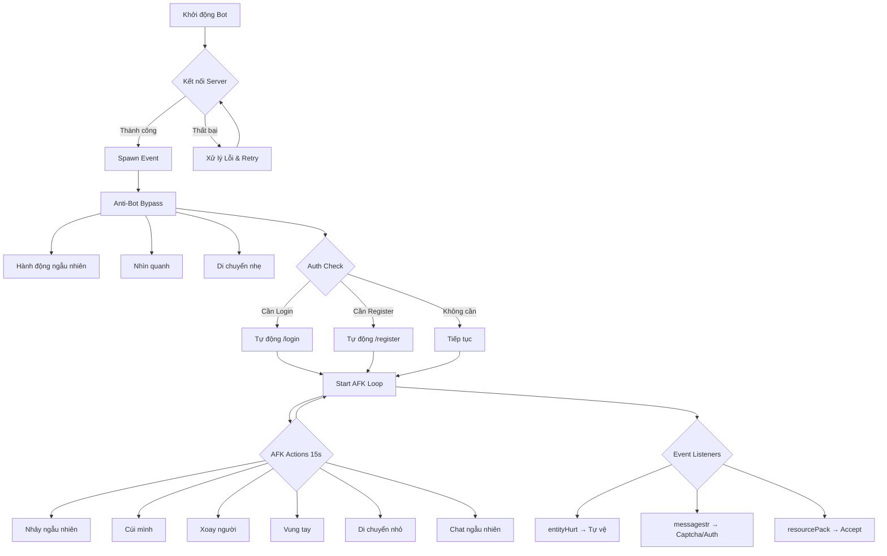

# 🤖 Bot AFK Minecraft Pro v6.0

Bot Minecraft tự động AFK với khả năng vượt qua Anti-Bot, tự vệ, và nhiều tính năng thông minh khác.

## 🌟 Tính Năng

✅ **Tự động AFK thông minh** - Bắt chước hành vi người thật để qua mặt Anti-AFK  
✅ **Vượt Anti-Bot** - Giải Captcha toán học, hành động tự nhiên khi vào server  
✅ **Tự động đăng nhập/đăng ký** - Tự động xác thực với AuthMe  
✅ **Tự vệ chiến đấu** - Phản công khi bị tấn công  
✅ **Tự động ăn uống** - Duy trì máu đầy đủ  
✅ **Tự động mặc giáp** - Trang bị giáp tốt nhất trong inventory  
✅ **Tự động ngủ** - Ngủ khi trời tối hoặc trời mưa  
✅ **Chấp nhận Resource Pack** - Tự động chấp nhận resource pack của server  
✅ **Tự động kết nối lại** - Kết nối lại khi bị ngắt  
✅ **Log chi tiết** - Theo dõi mọi hoạt động của bot  

---

## 🔒 QUAN TRỌNG - BẢO MẬT

### ⚠️ CẢNH BÁO BẢO MẬT

**KHÔNG BAO GIỜ** chia sẻ file `config.json` của bạn!  
File này chứa **MẬT KHẨU** và thông tin nhạy cảm.

### 🛡️ Các bước bảo mật:

1. ✅ File `.gitignore` đã được tạo tự động để bảo vệ `config.json`
2. ✅ Không push file `config.json` lên GitHub
3. ✅ Không screenshot hoặc chia sẻ nội dung file `config.json`
4. ✅ Sử dụng mật khẩu khác biệt cho bot (không dùng mật khẩu chính)

---

## 📦 Cài Đặt

### 1. Yêu Cầu Hệ Thống
- **Node.js** >= 18.0.0 ([Tải tại đây](https://nodejs.org/))
- **NPM** (đi kèm với Node.js)

### 2. Clone Repository

```bash
git clone https://github.com/your-username/bot-afk-aternos.git
cd bot-afk-aternos
```

### 3. Cài Đặt Dependencies

```bash
npm install
```

### 4. Cấu Hình Bot

**Bước 1:** Copy file mẫu:
```bash
cp config.example.json config.json
```

**Bước 2:** Mở file `config.json` và chỉnh sửa:

```json
{
  "server_info": {
    "ip": "your-server.aternos.me",    // 🔧 Thay bằng IP server của bạn
    "port": 25565,                      // 🔧 Port server (thường là 25565)
    "version": "1.20.1"                 // 🔧 Phiên bản MC (hoặc "false" để tự động)
  },
  "bot_account": {
    "username": "Bot_AFK_2024",         // 🔧 Tên bot
    "password": "YOUR_PASSWORD_HERE",   // 🔒 MẬT KHẨU (cho AuthMe)
    "auth_type": "offline"              // offline | microsoft | mojang
  },
  "auth_settings": {
    "login_cmd": "/login {pass}",       // Lệnh đăng nhập (AuthMe)
    "register_cmd": "/register {pass} {pass}"  // Lệnh đăng ký
  },
  "features": {
    "auto_reconnect": true,             // Tự động kết nối lại khi ngắt
    "auto_eat": true,                   // Tự động ăn uống
    "auto_equip": true,                 // Tự động mặc giáp
    "auto_sleep": true,                 // Tự động ngủ
    "combat_self_defense": true,        // Tự vệ khi bị đánh
    "accept_resource_pack": true,       // Chấp nhận resource pack
    "solve_math_captcha": true          // Giải captcha toán học
  },
  "messages": [
    "Xin chào mọi người!",              // Tin nhắn ngẫu nhiên (hiếm khi gửi)
    "Bot đang AFK"
  ]
}
```

### 5. Chạy Bot

```bash
npm start
```

---

## 🎯 Hướng Dẫn Sử Dụng

### Với Server Aternos:

1. Khởi động server Aternos của bạn
2. Đợi server online (kiểm tra tại aternos.org)
3. Lấy địa chỉ server (VD: `yourserver.aternos.me`)
4. Điền vào `config.json` → `server_info.ip`
5. Chạy bot: `npm start`

### Với Server Khác:

- Nếu server có **AuthMe**: Bot sẽ tự động đăng nhập/đăng ký
- Nếu server có **Anti-Bot**: Bot sẽ tự động bắt chước người thật
- Nếu server có **Captcha toán học**: Bot sẽ tự động giải

---

## 🐛 Xử Lý Lỗi Thường Gặp

### ❌ Lỗi: `ECONNREFUSED`
**Nguyên nhân:** Server đang tắt hoặc sai IP/Port  
**Giải pháp:**
- Kiểm tra server Aternos đã BẬT chưa
- Kiểm tra lại IP và Port trong `config.json`

### ❌ Lỗi: `ETIMEDOUT` / `socket hung up`
**Nguyên nhân:** Mạng yếu hoặc server lag  
**Giải pháp:**
- Kiểm tra kết nối internet
- Đợi server ổn định rồi thử lại

### ❌ Lỗi: Decoder / Packet
**Nguyên nhân:** Sai phiên bản Minecraft  
**Giải pháp:**
- Thay đổi `version` trong `config.json` (VD: `"1.20.1"`)
- Hoặc đặt `"version": false` để tự động nhận diện

### ❌ Bot bị Kick: "You are not authenticated"
**Nguyên nhân:** Server có AuthMe nhưng chưa đăng ký  
**Giải pháp:**
- Đảm bảo `password` trong `config.json` đã điền đúng
- Kiểm tra `auth_settings` có đúng lệnh của server không

---

## 🔧 Tùy Chỉnh Nâng Cao

### Tắt/Bật Tính Năng:

Trong `config.json`, sửa `features`:

```json
"features": {
  "auto_reconnect": true,      // false = Không tự động kết nối lại
  "auto_eat": false,           // false = Không tự động ăn
  "combat_self_defense": false // false = Không tự vệ
}
```

### Thay Đổi Tin Nhắn AFK:

```json
"messages": [
  "Tin nhắn tùy chỉnh của bạn",
  "Bot đang nghỉ ngơi",
  "[AFK] Tôi sẽ quay lại sau"
]
```

---

## 📊 Kiến Trúc Bot



---

## 🤝 Đóng Góp

Nếu bạn muốn cải thiện bot:

1. Fork repository này
2. Tạo branch mới: `git checkout -b feature/TenTinhNang`
3. Commit thay đổi: `git commit -m 'Thêm tính năng XYZ'`
4. Push lên branch: `git push origin feature/TenTinhNang`
5. Tạo Pull Request

---

## ⚖️ Lưu Ý Pháp Lý

- Bot này chỉ dùng cho mục đích học tập và giải trí
- Không sử dụng bot để spam hoặc làm phiền người chơi khác
- Tuân thủ quy định của server bạn chơi
- Admin server có quyền kick/ban bot nếu vi phạm quy định
- Tác giả không chịu trách nhiệm nếu bot bị ban

---

## 📝 Thông Tin

- **Phiên bản:** 6.0.0
- **Tác giả:** ThinhDZS1VN
- **Node.js yêu cầu:** >= 18.0.0
- **License:** MIT (xem file LICENSE)

---

## 🌐 Liên Hệ & Hỗ Trợ

Nếu gặp vấn đề hoặc cần hỗ trợ:

- 📧 Email: trongthinhm@gmail.com
- 🐛 Báo lỗi: [GitHub Issues](../../issues)
- ⭐ Nếu thấy hữu ích, hãy cho repo này 1 star!

---

## 📜 Changelog

### v6.0.0 (2026-03-11)
- ✨ Thêm hệ thống Anti-Bot Bypass thông minh
- ✨ Giải Captcha toán học tự động
- ✨ Tự vệ chiến đấu
- ✨ Tự động ăn & mặc giáp
- ✨ Tự động ngủ
- ✨ Log đẹp mắt với emoji
- ✨ Xử lý lỗi chi tiết hơn
- 🔒 Thêm hướng dẫn bảo mật
- 📚 README hoàn thiện

---

**⚠️ NHẮC NHỞ CUỐI:** Đừng quên thêm file `config.json` vào `.gitignore` và KHÔNG BAO GIỜ push nó lên GitHub!

**🎮 Chúc bạn AFK vui vẻ!**
